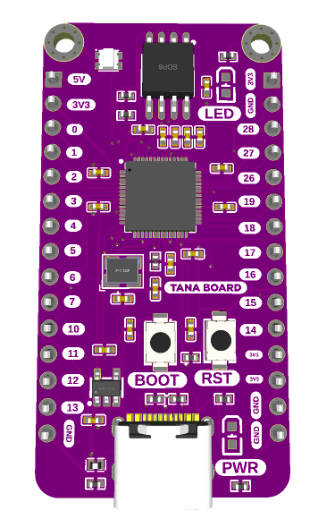

# Hand Motion Controller

Docs, Schematic and Board file for a the Tana development board based on the RP2040 chip.

## Overview

Tana board development board

## Features

- RP2040
- WS2812 RGB LEDs
- USB C compatible
- In built power supply from usb c connector
- Power on LED
- Solder pads to test the board
- Mounting holes
- Small Package and Footprint

## Structure of this repository

- [/assets](assets/)
Contains the pictures and 3D model for the board
- [/datasheets](datasheets/)
Contains the relevant datasheets of the components used on the board
- [/pinout](pinout/)
Contains the pinout for the board
- [/production](production/)
Contains the manufacturing gerber files and bill of materials for the board
- [/schematic](schematic/)
Contains the schematic files
- [/src](src/)
Contains easy eda design files for bothe PCB and schematic

## Hardware datasheet

The complete datasheet for the Tana board is available [here](commingsoon).

## Tools

1. [Label maker](https://github.com/xsrf/easyeda-labelmaker)
2. [ibom extension](https://github.com/turbobabr/easyeda-ibom-extension)

## Support 0x6flab

We love designing, making, and releasing projects and products that empower others to learn and build amazing things! I do it because we believe it’s important to share knowledge and give back to the community as many have done before us. It helps us all learn and grow.

Please consider supporting me by buying some of my products from:

- [Nerokas](http://nerokas.co.ke/)
- [Pixel Electric](https://www.pixelelectric.com)
